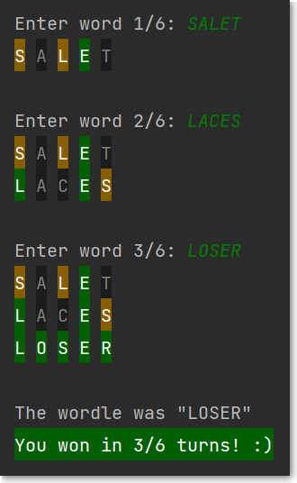

This is a simplified clone of the polular online word-guessing game, <a href="https://www.powerlanguage.co.uk/wordle/">Wordle</a>. To run ```WordleCLI```, clone this repository and enter the following commands:
```
javac WordleCLI.java
java WordleCLI
```



NOTE: This program works only in terminals that support <a href="https://en.wikipedia.org/wiki/ANSI_escape_code">ANSI escape codes</a>.